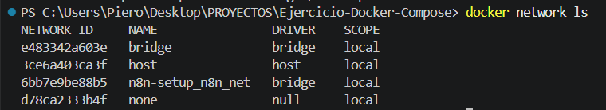
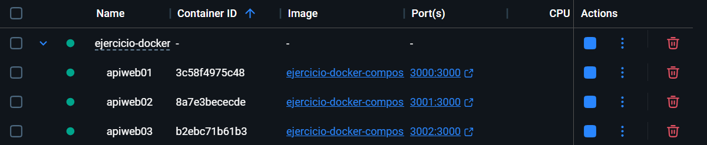
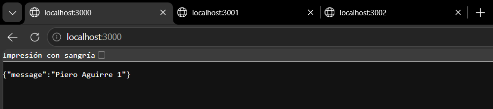
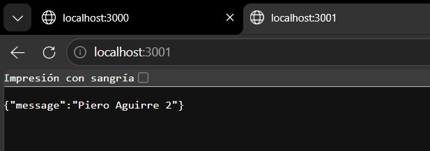
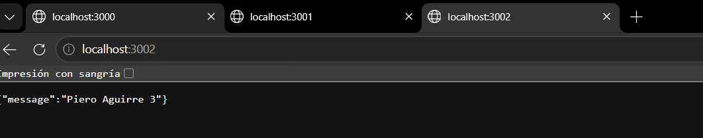

# Laboratorio 02
Hoy utlizaremos docker compose para poder desplegar un servicio web y una base de
datos
STACK Tecnico
API
- Aplicación JAVA dockerizarla (crear la imagen)
- docker pull nmatsui/hello-world-api
- clever_montalcini 3001
- condescending_davinci 3000
- $ docker run -d --rm -p 3000:3000 nmatsui/hello-world-api
-
BD PostgreSQL
docker run --name some-postgres -e POSTGRES_PASSWORD=mysecretpassword -d postgres
COMANDOS
Deben especificar los comandos que voy a ejecutar
```bash
docker compose up -d
```
CONFIGURACIONES
.env
```
VAR=VALUE
```
# Actividad
Trabajar un docker compose, especificando configuración y comandos para despliegue.
Debe permitir lo siguiente:
- 3 copias de una API build local(x)
- Configuración BD
- Uso de volúmenes(x)
- Uso de variables de entorno(x)
- En README. Responder los tipos de redes y los tipos de volumen que existen en(x)
docker
- Hacer uso de Conventional Commits(x)
- Repositorio publico(x)
- Uso de .gitignore(x)
- Opcional: Capturas de su proyecto desplegado(x)
# Tipos de redes en docker

NETWORK ID: El identificador único de la red.

NAME: nombre asignado a la red. 

SCOPE: Alcance para una red (En mi caso en local)
DRIVER: El controlador que gestiona la red:

- bridge: La red aislada por defecto en la que se ejecutan los contenedores si no especificas otra.(en mi caso esta asignado un proyecto pasado con n8n)

- host: Remueve el aislamiento de red entre el contenedor y el host.

- none: Desactiva completamente las interfaces de red del contenedor.

Comando para listar las redes:

docker network ls

Fuente:
https://iesgn.github.io/curso_docker_2021/sesion4/tipos.html
# Tipos de volumen en docker

Comando para listar los volumenes:

docker volume ls

Named Volumes (Volúmenes con nombre):
- Gestionados completamente por Docker dentro del directorio del sistema.

Bind Mounts (Montajes vinculados):
- Mapean un archivo o directorio específico de tu máquina host.

tmpfs Mounts:
- Se almacenan únicamente en la memoria RAM del host, no en el disco.


# APIs DESPLEGADAS
Docker Desktop (Captura):


API 1:


API 2:


API 3: 

