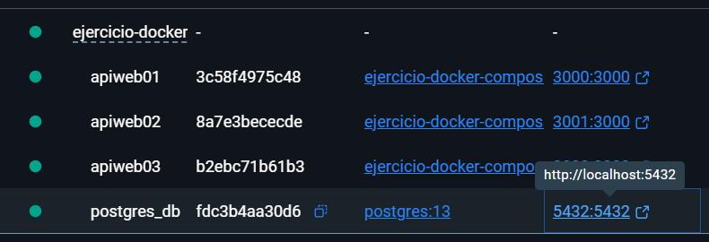

# Laboratorio 02
Hoy utlizaremos docker compose para poder desplegar un servicio web y una base de
datos
# STACK Tecnico:
API
- Aplicación JAVASCRIPT dockerizarla (crear la imagen)
- docker pull nmatsui/hello-world-api
- $ docker run -d --rm -p 3000:3000 nmatsui/hello-world-api

# Actividad - CULMINADA (X)
Trabajar un docker compose, especificando configuración y comandos para despliegue.(x)
Debe permitir lo siguiente:
- 3 copias de una API build local(x)
- Configuración BD(x)
- Uso de volúmenes(x)
- Uso de variables de entorno(x)
- En README. Responder los tipos de redes y los tipos de volumen que existen en
docker(x)
- Hacer uso de Conventional Commits(x)
- Repositorio publico(x)
- Uso de .gitignore(x)
- Opcional: Capturas de su proyecto desplegado(x)
# Tipos de redes en docker

NETWORK ID: El identificador único de la red.

NAME: nombre asignado a la red. 

SCOPE: Alcance para una red (En mi caso en local)
DRIVER: El controlador que gestiona la red:

- bridge: La red aislada por defecto en la que se ejecutan los contenedores si no especificas otra.(en mi caso esta asignado un proyecto pasado con n8n)

- host: Remueve el aislamiento de red entre el contenedor y el host.

- none: Desactiva completamente las interfaces de red del contenedor.

Comando para listar las redes:
```bash
docker network ls
```
Fuente:
https://iesgn.github.io/curso_docker_2021/sesion4/tipos.html
# Tipos de volumen en docker

Comando para listar los volumenes:
```bash
docker volume ls
```
Named Volumes (Volúmenes con nombre):
- Gestionados completamente por Docker dentro del directorio del sistema.
En mi trabajo lo aplico en la declaración de la base de datos, ya que los datos persistirán aunque se destruya la imagen.
  
Bind Mounts (Montajes vinculados):
- Mapean un archivo o directorio específico de tu máquina host.
En mi trabajo lo aplico en la declaración de las APIs, ya que sirve para registrar los logs de forma local en el contenedor
y permite que sean más legibles.

tmpfs Mounts:
- Se almacenan únicamente en la memoria RAM del host, no en el disco.
No lo aplico en mi trabajo, porque no uso archivos temporales.

# COMANDOS DE DESPLIEGUE
1. Clonar el repositorio
```bash
git clone [https://github.com/PieroAguirreDC/Ejercicio-Docker-Compose.git](https://github.com/PieroAguirreDC/Ejercicio-Docker-Compose.git)
cd Ejercicio-Docker-Compose
```
2. Configurar las variables de Entorno
```bash
Copy-Item .env.example .env
```
3. Despliegue de los contenedores docker
```bash
docker compose up -d --build
```

# APIs DESPLEGADAS
Docker Desktop (Captura):


API 1:

API 2:

API 3: 


# BASE DE DATOS DESPLEGADA
BD:

